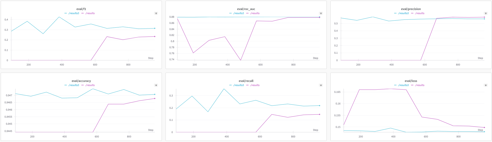

# BeyondTheHype_Hackathon

**Project Synopsis: Predicting Heart Attack Risk Using a Pre-trained Language Model**

We utilize a pre-trained transformer model, DistilBERT (66M parameters), for predicting heart attack risk. Using a heart attack dataset with significant class imbalance (~5% heart attack cases), we performed Principal Component Analysis (PCA) to identify the most impactful features. These features were transformed into natural language prompts, such as:
"The patient is a female aged 80 or older, with a BMI of 21.6. Their general health is good, and they have a history of arthritis. They also experience difficulty running errands and hearing. Based on this information, is the patient at risk of a heart attack?"

We tested two approaches:

1. Fine-tuning DistilBERT on the dataset.
2. Applying Low-Rank Adaptation (LoRA) by freezing the base model and fine-tuning low-rank parameters.
   
This study highlights the potential of leveraging natural language processing models for structured healthcare data analysis and risk prediction.

## Results
Teal (Fine-tuned DistilBERT), Purple (LoRA-tuned DistilBERT)

